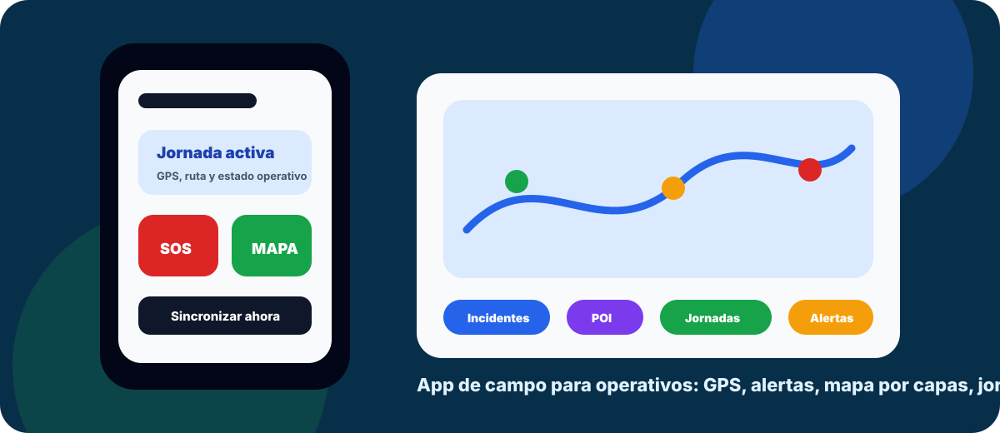
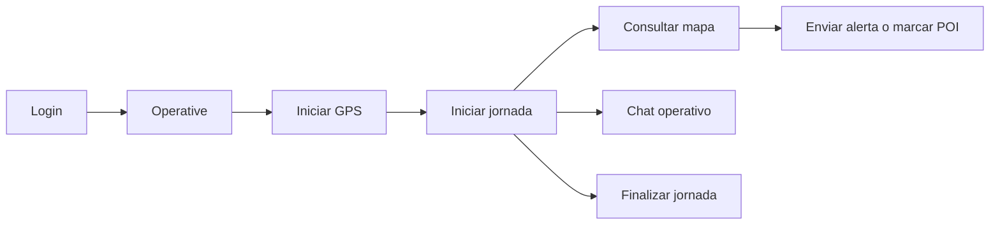
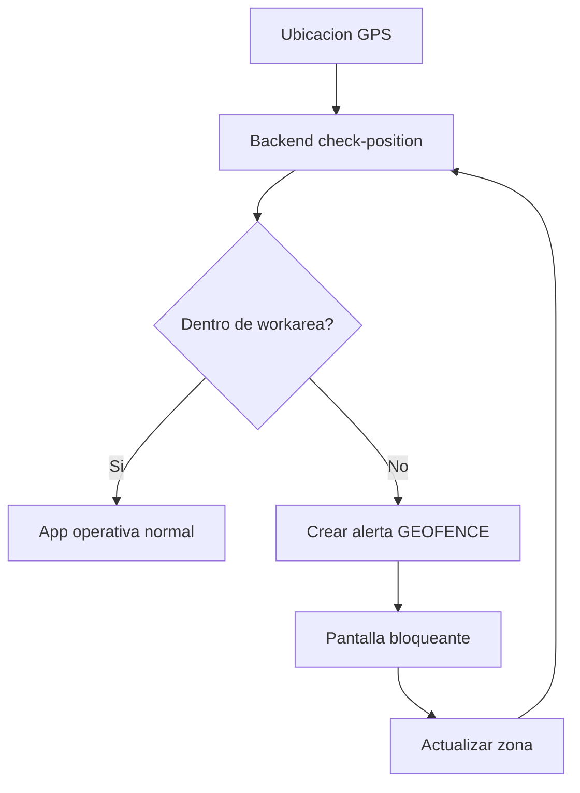

# Mobile App | Mando Operativo en Campo

<p align="center">
  
</p>

<p align="center">
  
  
  
  
  
</p>

La **Mobile App** es la herramienta de campo para personal operativo. Permite iniciar sesion, activar GPS, enviar alertas, consultar incidentes, marcar puntos de interes, usar chat, controlar jornadas y mantenerse sincronizado con el centro de supervision.

Esta app esta pensada para uso rapido en terreno: **botones grandes, acciones directas, mapa por capas y funcionamiento con cola offline cuando la conexion falla**.

## Para Que Sirve

| Necesidad en campo | Como ayuda la app |
| --- | --- |
| Avisar rapido | Envio de alertas y SOS desde ubicacion actual. |
| Saber donde estoy | Mapa operativo con posicion, incidentes, POI, alertas y jornadas. |
| Registrar actividad | Inicio, pausa y finalizacion de jornada. |
| No perder datos | Cola offline para tracking, alertas y puntos de interes. |
| Coordinarse | Chat movil general y por incidentes. |
| Mantener seguridad | Deteccion de salida de workarea y bloqueo visual. |

## Funciones Principales

### 1. Operativa Diaria

- Login con JWT.
- Pantalla principal para acciones rapidas.
- Inicio y cierre de jornada.
- Registro de descansos.
- Estado de distancia, duracion, calorias estimadas y fatiga.

### 2. Alertas y Seguridad

- Envio manual de alertas.
- Boton SOS.
- Tipos de alerta operativos: SOS, caida, fuego, humo, herido, evacuacion, recursos bajos, perdida de comunicacion, fatiga, clima peligroso y mas.
- Deteccion de salida de zona segura (`GEOFENCE`).
- Pantalla bloqueante al salir del workarea.

### 3. Mapa Operativo

- Mapa a pantalla completa.
- Capas seleccionables:
  - incidentes;
  - alertas;
  - puntos de interes;
  - jornadas;
  - todas a la vez.
- POI con boton para abrir incidente relacionado.
- Visualizacion de recorridos de jornada.

### 4. Offline y Sincronizacion

- Cola persistente en `AsyncStorage`.
- Reintento automatico al volver la conexion.
- Sincronizacion manual desde ajustes.
- Compatible con tracking, alertas y POI.

## Galeria

> Puedes sustituir estas imagenes conceptuales por capturas reales del dispositivo cuando prepares la presentacion.

| App de campo | Vista operativa |
| --- | --- |
|  | GPS -> Mapa -> Alerta -> Jornada -> Chat |

## Flujo Operativo



## Seguridad por Workarea



## Stack

| Capa | Tecnologia |
| --- | --- |
| App | React Native + Expo SDK 50 |
| Lenguaje | TypeScript |
| Navegacion | React Navigation |
| Sesion | JWT + `expo-secure-store` |
| Ubicacion | `expo-location` |
| Segundo plano | `expo-task-manager` |
| Persistencia offline | `AsyncStorage` |
| Mapa | WebView + Leaflet/OpenStreetMap y componentes nativos donde aplica |

## Pantallas Principales

| Pantalla | Uso |
| --- | --- |
| `Login` | Acceso del operativo |
| `Operative` | Centro de acciones en campo |
| `Map` | Mapa operativo por capas |
| `Alert` | Envio manual de alertas |
| `Incidents` | Incidentes asociados |
| `Incident` | Detalle de incidente |
| `Chat` | Conversaciones generales e incidentes |
| `PointsOfInterest` | Alta y consulta de POI |
| `StartJourney` | Inicio de jornada |
| `StartBreak` | Registro de descanso |
| `StopJourney` | Cierre y resumen de jornada |
| `Profile` | Perfil operativo |
| `Settings` | Diagnostico y sincronizacion |

## Puesta en Marcha

### 1. Configurar API

Variables utiles en `mobile-app/.env`:

```bash
EXPO_PUBLIC_API_BASE_URL=https://tfg-backend-jrrn.onrender.com/api
```

La app usa ese backend desplegado por defecto si no existe `.env`.

Android fisico por USB con backend local:

```bash
EXPO_PUBLIC_ANDROID_API_HOST=http://127.0.0.1:8000
adb reverse tcp:8000 tcp:8000
```

Emulador Android con backend local:

```bash
EXPO_PUBLIC_ANDROID_API_HOST=http://10.0.2.2:8000
```

iPhone simulador con backend local:

```bash
EXPO_PUBLIC_IOS_API_HOST=http://localhost:8000
```

### 2. Instalar dependencias

```bash
npm install
```

### 3. Arrancar Expo

```bash
npm run start
```

### 4. Ejecutar en Android

```bash
npm run android
```

## Permisos Android

La app necesita permisos de ubicacion y segundo plano:

- `ACCESS_COARSE_LOCATION`
- `ACCESS_FINE_LOCATION`
- `ACCESS_BACKGROUND_LOCATION`
- `FOREGROUND_SERVICE`
- `FOREGROUND_SERVICE_LOCATION`
- `POST_NOTIFICATIONS`

Configurados en:

- `app.json`
- `android/app/src/main/AndroidManifest.xml`

## Archivos Clave

| Archivo | Responsabilidad |
| --- | --- |
| `App.tsx` | Navegacion y providers |
| `src/context/AuthContext.tsx` | Login, sesion y refresh JWT |
| `src/context/LocationContext.tsx` | GPS, tracking, workarea y fatiga |
| `src/context/OfflineSyncContext.tsx` | Cola offline |
| `src/services/api.ts` | Cliente API y fallback de URLs |
| `src/screens/OperativeScreen.tsx` | Pantalla principal |
| `src/components/MapaOperativo.tsx` | Mapa por capas |
| `src/screens/AlertScreen.tsx` | Envio de alertas |
| `src/screens/ChatScreen.tsx` | Chat movil |
| `src/screens/PointsOfInterestScreen.tsx` | Puntos de interes |
| `src/components/GeofenceLockScreen.tsx` | Bloqueo por workarea |
| `src/screens/SettingsScreen.tsx` | Diagnostico y sincronizacion |

## Integracion con el Panel Web

| Desde el panel | En la app movil |
| --- | --- |
| Incidentes | Consulta y detalle operativo |
| Workareas | Deteccion de entrada/salida |
| Alertas | Visualizacion y envio desde campo |
| POI | Alta desde mapa o ubicacion actual |
| Jornadas | Registro de actividad |
| Chat | Comunicacion por incidente o general |

## Estado del Proyecto

Funcionalidades destacadas:

- Login y sesion segura.
- GPS foreground/background.
- Cola offline.
- Mapa operativo por capas.
- Alertas ampliadas.
- Workarea/geofence.
- Chat movil.
- Jornadas y descansos.
- Puntos de interes.
- Perfil y ajustes.

Pendientes recomendados:

- Integrar push notifications.
- Mejorar contador de mensajes no leidos.
- Asociar alertas y POI automaticamente a incidente activo cuando aplique.
- Cachear workareas para validacion local offline.
- Sustituir assets conceptuales del README por capturas reales.
