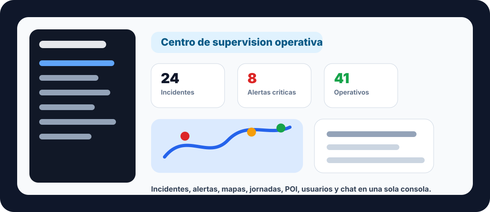
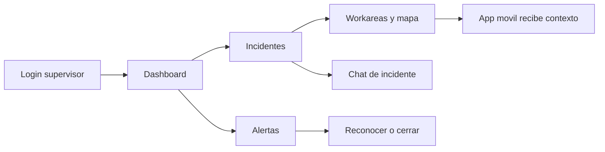
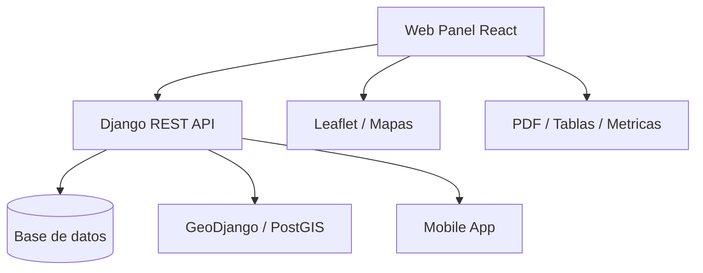

# Web Panel | Centro de Supervision Operativa

<p align="center">
  
</p>

<p align="center">
  
  
  
  
  
</p>

El **Web Panel** es la consola de coordinacion del sistema Emergency. Esta pensado para perfiles de administracion, supervision y mando que necesitan una vista global del operativo: incidentes abiertos, alertas, usuarios, unidades, workareas, jornadas, puntos de interes, meteorologia, rayos y comunicaciones.

La idea es sencilla: **un unico lugar para ver que esta pasando, decidir rapido y coordinar mejor**.

## Vista Rapida

| Area | Que resuelve |
| --- | --- |
| Dashboard | Vision inmediata del estado operativo y metricas clave. |
| Incidentes | Alta, edicion, seguimiento y chat asociado a incidentes. |
| Alertas | Priorizacion, reconocimiento, cierre y trazabilidad. |
| Mapa operativo | Workareas, puntos de interes y contexto geografico. |
| Personal | Gestion de usuarios, unidades y organizaciones. |
| Jornadas | Consulta del trabajo en campo y actividad de operativos. |
| Comunicacion | Chat general y chats ligados a incidentes. |

## Modulos Principales

### 1. Centro Operativo

- Dashboard con indicadores de actividad.
- Listados paginados y buscables.
- Estados visuales para alertas, incidentes y severidad.
- Acciones rapidas de reconocimiento, cierre y edicion.

### 2. Incidentes y Alertas

- Crear y editar incidentes.
- Consultar alertas asociadas.
- Ver detalle, estado, severidad y responsable.
- Mantener comunicacion mediante chat del incidente.

### 3. Mapa y Territorio

- Workareas circulares y poligonales.
- Puntos de interes geolocalizados.
- Mapa de rayos y meteorologia.
- Base para que la app movil detecte salidas de zona segura (`GEOFENCE`).

### 4. Recursos y Organizacion

- Usuarios y perfiles operativos.
- Unidades.
- Organizaciones.
- Relacion entre operativos, supervision y estructura territorial.

## Galeria

> Las imagenes siguientes son assets visuales del README. Puedes sustituirlas por capturas reales del panel cuando prepares la entrega o la demo.

| Vista general | Flujo operativo |
| --- | --- |
|  | Dashboard -> Incidente -> Alerta -> Mapa -> Chat |

## Flujo de Uso



## Arquitectura Funcional



## Stack

| Capa | Tecnologia |
| --- | --- |
| UI | React 18 + TypeScript |
| Build | Vite |
| Rutas | React Router |
| Estado | Zustand |
| Mapas | Leaflet / React Leaflet |
| Graficas | Chart.js |
| Exportacion | jsPDF + AutoTable |
| Estilos | Tailwind / CSS del panel |

## Puesta en Marcha

### 1. Configurar API

Crea `web-panel/.env`:

```bash
VITE_API_BASE_URL=http://127.0.0.1:8000/api
```

### 2. Instalar dependencias

```bash
npm install
```

### 3. Ejecutar en desarrollo

```bash
npm run dev
```

Vite sirve normalmente en:

```text
http://localhost:5173
```

### 4. Generar build

```bash
npm run build
```

## Rutas Importantes

| Ruta | Uso |
| --- | --- |
| `/login` | Acceso al panel |
| `/` | Dashboard |
| `/incidents` | Incidentes |
| `/alerts` | Alertas |
| `/weather` | Meteorologia |
| `/lightning` | Rayos |
| `/workarea` | Workareas |
| `/journeys` | Jornadas |
| `/points` | Puntos de interes |
| `/chats` | Chat general |
| `/viewusers` | Usuarios |
| `/vieworganizations` | Organizaciones |

## Archivos Clave

| Archivo | Responsabilidad |
| --- | --- |
| `src/App.tsx` | Rutas principales |
| `src/components/Layout.tsx` | Shell privado y navegacion |
| `src/store/authStore.ts` | Sesion del panel |
| `src/utils/api.ts` | Cliente HTTP |
| `src/pages/DashboardPage.tsx` | Dashboard |
| `src/pages/IncidentsPage.tsx` | Incidentes |
| `src/pages/AlertsPage.tsx` | Alertas |
| `src/pages/WorkAreasPage.tsx` | Workareas |
| `src/pages/JourneysPage.tsx` | Jornadas |
| `src/pages/PointOfInterestPage.tsx` | Puntos de interes |
| `src/components/ChatGeneral.tsx` | Chat general |

## Integracion con la App Movil

El panel y la app movil comparten el mismo backend. El panel define y supervisa el contexto operativo; la app movil lo consume en campo.

| Panel web | App movil |
| --- | --- |
| Crea incidentes | Consulta incidentes asignados |
| Define workareas | Detecta salida de zona |
| Gestiona alertas | Envia alertas desde campo |
| Crea puntos de interes | Marca POI desde ubicacion actual |
| Supervisa jornadas | Inicia, pausa y finaliza jornada |
| Chat del incidente | Mensajeria operativa |

## Estado del Proyecto

Funcionalidades destacadas:

- Autenticacion de panel.
- Dashboard operativo.
- Gestion de incidentes, alertas, usuarios, unidades y organizaciones.
- Workareas con mapa.
- Puntos de interes.
- Jornadas.
- Meteorologia y rayos.
- Chat general y chat de incidente.

Pendientes recomendados:

- Normalizar nombres de rutas.
- Persistir filtros y orden de tablas.
- Mejorar permisos por rol.
- Incorporar tiempo real para chat, alertas y tracking.
- Sustituir los assets conceptuales del README por capturas reales.
